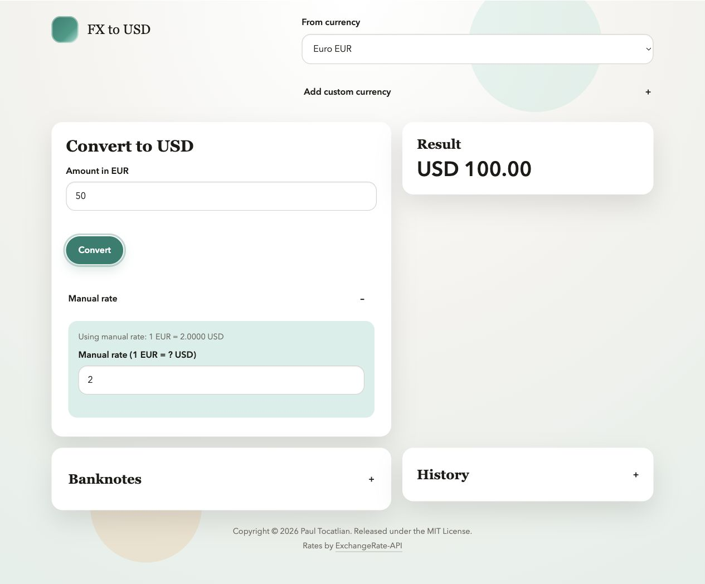

# FX to USD Converter

[](https://github.com/tocatlian/fx2usd/actions/workflows/ci.yml)
[](LICENSE)
[](package.json)

FX to USD Converter is a small, installable browser app for converting foreign currency amounts to US dollars. It fetches live exchange rates, keeps a local cache for offline fallback, supports manual rate overrides, and shows USD equivalents for common banknotes.

The app is intentionally static: no backend, no build step, and no account required.

Live demo: [tocatlian.github.io/fx2usd](https://tocatlian.github.io/fx2usd/)



## Features

- Convert supported foreign currencies to USD with live ExchangeRate-API data.
- Use cached exchange rates when live rates are unavailable.
- Enter a manual rate when a real counter, receipt, or market quote differs from the live rate.
- Add custom three-letter currency codes that persist in browser storage.
- View banknote denomination references for supported currencies.
- Track recent rate changes in local history.
- Install as a lightweight progressive web app through the browser.
- Load the app shell offline after the first served visit.

## Quick Start

Open `index.html` directly in a browser for a quick look, or run a local server:

```bash
npm start
```

Then visit `http://localhost:8000`.

The offline app shell uses a service worker, so it is available when the app is served from `localhost`, `127.0.0.1`, or HTTPS.

## Requirements

- Node.js 20 or newer for project scripts and tests.
- A modern browser with `localStorage`, `fetch`, and `Intl` support.

The browser app itself does not require Node.js after it is deployed.

## Development

Install the locked dependency set:

```bash
npm ci
```

Run tests:

```bash
npm test
```

Run the full local quality gate:

```bash
npm run check
```

Serve locally:

```bash
npm run serve
```

Build the static deployment output:

```bash
npm run build
```

The test suite uses Node's built-in test runner and a small fake DOM harness. The full check also runs formatting, JavaScript linting, CSS linting, HTML validation, project metadata validation, tests, and the static deployment build.

## Project Structure

```text
.
È›y¯ßy€ßuÁ‚ùÁ@∫w^~)fit .github/              # GitHub templates, CI, Dependabot, and Pages deployment
∫w^~)fivÈ›y¯ßy€ßuÁ‚ùÁ@ docs/                 # Repository images and supporting documentation assets
È›y¯ßy€ßuÁ‚ùÁ@∫w^~)fit scripts/              # Local development, build, and validation helpers
∫w^~)fivÈ›y¯ßy€ßuÁ‚ùÁ@ tests/                # Node regression testsßuÁ‚ùÁ\∫w^~)fivÈ›y¯ßy– app.js                # Browser application logicßuÁ‚ùÁ\∫w^~)fivÈ›y¯ßy– index.html            # Static application shell
È›y¯ßy€ßuÁ‚ùÁ@∫w^~)fit manifest.webmanifest  # PWA manifest
∫w^~)fivÈ›y¯ßy€ßuÁ‚ùÁ@ sw.js                 # Service worker for offline loading
∫w^~)fivÈ›y¯ßy€ßuÁ‚ùÁ@ styles.css            # Application styles
```

## Deployment

This project includes a GitHub Pages workflow at `.github/workflows/pages.yml`. After publishing the repository, enable GitHub Pages with GitHub Actions as the source. Pushes to `main` will run the quality gate, build `dist/`, and deploy the static app.

See [PUBLISHING.md](PUBLISHING.md) for the short GitHub release checklist.

For other static hosts, deploy the files generated by:

```bash
npm run build
```

## Data and Privacy

The app stores selected currency, custom currencies, cached rates, and rate history in the user's browser `localStorage`. It does not send this saved data to a project-owned server. The service worker caches same-origin app files for offline loading, while live rates are fetched from ExchangeRate-API. See [PRIVACY.md](PRIVACY.md) for details.

## Rate Source

Live rates are fetched from the open ExchangeRate-API endpoint at `https://open.er-api.com`. No API key is required by this project.

## Contributing

Contributions are welcome. Please read [CONTRIBUTING.md](CONTRIBUTING.md), follow the [Code of Conduct](CODE_OF_CONDUCT.md), and run `npm run check` before opening a pull request.

## Security

Please report suspected vulnerabilities privately. See [SECURITY.md](SECURITY.md).

## License

Released under the [MIT License](LICENSE).
